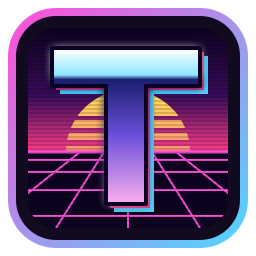

<p align="center">
  
</p>

<h1 align="center">tron</h1>

<p align="center">
  A GPU accelerated terminal emulator written in Rust. Fast first, then beautiful.
</p>

<p align="center">
  <a href="https://github.com/skyline69/tron-terminal/actions/workflows/ci.yml"></a>
  
  
</p>

<p align="center">
  <a href="https://github.com/skyline69/tron-terminal/wiki"><b>Documentation</b></a> ·
  <a href="https://github.com/skyline69/tron-terminal/wiki/Installation">Installation</a> ·
  <a href="https://github.com/skyline69/tron-terminal/wiki/Configuration">Configuration</a> ·
  <a href="https://github.com/skyline69/tron-terminal/wiki/Shaders">Shaders</a> ·
  <a href="https://github.com/skyline69/tron-terminal/wiki/Troubleshooting">Troubleshooting</a>
</p>


- **Fast.** Custom parser and screen model with SIMD friendly fast paths,
  lock-free frame building and frame pacing. Faster than Alacritty and Ghostty
  in the throughput benchmarks below.
- **Good text.** HarfBuzz-grade shaping through `harfrust` with programming
  ligatures, font fallback through fontconfig, color emoji, and box drawing,
  block and Powerline glyphs drawn to fit every cell exactly. Right-to-left
  text (Arabic, Hebrew) is reordered for display, double width and double
  height lines work, and grapheme clusters take their real width (mode 2027).
- **Customizable.** WGSL post-processing shaders, themes, hot reloaded
  configuration and key bindings.
- **Modern protocols.** Kitty graphics (including animation, frame
  composition, relative placements, shared memory and Unicode placeholders),
  kitty keyboard and text sizing protocols, iTerm2 inline images (PNG, JPEG,
  animated GIF), Sixel, synchronized output, OSC 8 hyperlinks, OSC 52
  clipboard, OSC 133 prompt marks, desktop notifications (OSC 9, 99 and 777),
  styled underlines, true color.
- **Images and video.** `chafa`, `kitten icat`-style tools, `yazi` previews and
  `mpv --vo=kitty` work out of the box.

Linux (Wayland and X11) and macOS are supported. Tabs and splits are out of
scope: use your window manager or a multiplexer.

## Installation

The install script installs tron for the current user, on Linux and macOS:

```sh
curl -fsSL https://raw.githubusercontent.com/skyline69/tron-terminal/main/install.sh | bash
```

When the latest release has a prebuilt tron for your system, the script asks
whether to install it, which takes seconds, or to build from source. It
verifies downloads against their SHA-256 checksums. For a build, it checks for
Rust and the build libraries and offers to install what is missing. When tron
is already installed, it compares versions and asks before upgrading,
reinstalling or downgrading. From a checkout, run `./install.sh`.

- **Linux:** the binary goes to `~/.local/bin`, with a desktop entry, icons,
  AppStream metadata and shell completions under `~/.local/share`, so
  application launchers and desktop search (KRunner, GNOME Shell) find tron.
- **macOS:** `tron.app` goes to `/Applications`, where Spotlight and Launchpad
  find it, and `~/.local/bin/tron` links to it.

Each [release](https://github.com/skyline69/tron-terminal/releases) also has
packages you can install by hand:

| Package | For |
|---|---|
| `tron-VERSION-macos.dmg` | macOS: open it and drag tron to Applications. Universal (Apple Silicon and Intel) |
| `tron-VERSION-ARCH.AppImage` | Any Linux distribution: make it executable and run it |
| `tron-VERSION-ARCH.flatpak` | Linux with Flatpak: `flatpak install --user tron-VERSION-ARCH.flatpak`. Shells run on the host |
| `tron-VERSION-ARCH-linux.tar.gz`, `-macos.tar.gz` | The binary with `install.sh`, which installs it without Rust |

Linux packages need glibc 2.34 or newer (2021 and later distributions). The
macOS app is not notarized: the first time, open it with right click > Open, or
allow it under System Settings > Privacy & Security.

Options: `--prebuilt` or `--build` choose without asking, `--system` installs
for all users under `/usr/local`, `--prefix DIR` picks another location,
`--ref vX.Y.Z` installs a release (a branch name builds that branch), `--yes`
answers every question and `--uninstall` removes tron again. See
`./install.sh --help`.

## Building

Requires Rust 1.98 or newer. `tic` from ncurses is used at runtime to install
the bundled terminfo entry.

On Linux, install the development files for Wayland, xkbcommon and fontconfig:

```sh
# Fedora
sudo dnf install wayland-devel libxkbcommon-devel fontconfig-devel ncurses
# Debian / Ubuntu
sudo apt install libwayland-dev libxkbcommon-dev libfontconfig-dev ncurses-bin
```

macOS needs nothing beyond the Xcode command line tools; `tic` ships with the
system. Rendering goes through Metal.

```sh
cargo build --release
./target/release/tron
```

A desktop entry and icon live in `dist/`.

## Usage

```
tron [OPTIONS] [COMMAND]

  -e, --command <PROGRAM>...     Run a program instead of the shell
  -d, --working-directory <DIR>  Start in this directory
      --config-dir <DIR>         Use this configuration directory
      --startup                  Show the startup screen: welcome, setup and tour
  tron settings                  Change settings with a live preview
  tron themes | shaders | keys   Preview themes or shaders, show the key bindings
  tron tour | credits | about    Take the tour, show credits or the version
  tron completions <SHELL>       Print shell completions (bash, zsh, fish, ...)
```

Run inside a tron window, `tron settings` and the other tab commands open that
tab of the startup screen right in the window; elsewhere they open a new
window. Every tron window has the `tron` command on its `PATH`, whether tron
came from the disk image, an AppImage, a Flatpak or the install script.

The startup screen opens by itself the first time tron starts. Set
`startup = false` to never show it, or `startup = true` to show it every time.

### Default key bindings

| Keys | Action |
|---|---|
| `Ctrl+Shift+C` / `Ctrl+Shift+V` | Copy / paste |
| `Shift+Insert`, middle click | Paste the primary selection |
| `Ctrl+=` / `Ctrl+-` / `Ctrl+0` | Font size bigger / smaller / reset |
| `Shift+PageUp` / `Shift+PageDown` | Scroll a page |
| `Shift+Home` / `Shift+End` | Scroll to top / bottom |
| `Ctrl+Shift+F` | Search scrollback (Enter older, Shift+Enter newer, Esc close) |
| `Ctrl+Shift+Z` / `Ctrl+Shift+X` | Scroll to the previous / next shell prompt |
| `Ctrl+Shift+G` | Select the output of the last command |
| `Ctrl+Shift+N` | New window in the current directory |
| `Ctrl+Shift+,` | Reload configuration |
| `Ctrl+Shift+Backspace` | Delete the line before the cursor (sends `Ctrl+U`) |
| `Ctrl+click` | Open a link |

On macOS the defaults use Command instead: `Cmd+C` / `Cmd+V`, `Cmd+=` /
`Cmd+-` / `Cmd+0`, `Cmd+F` search, `Cmd+K` clear scrollback, `Cmd+Up` /
`Cmd+Down` previous / next prompt, `Cmd+Shift+Up` select command output,
`Cmd+N` new window, `Cmd+,` reload configuration, `Cmd+Backspace` delete the
line and `Cmd+click` to open a link. Option types special characters unless `option_as_alt` under `[window]`
is `left`, `right` or `both`. The shell starts as a login shell, like in
Terminal.app, and middle click pastes tron's own selection.

Mouse: drag to select, double click for words, triple click for lines,
`Alt`+drag for a block, `Shift`+click to extend. Hold `Shift` to select text in
applications that use the mouse. Dropping files inserts their shell-quoted
paths.

The kitty keyboard protocol reports alternate and base layout keys, keypad
keys and the Hyper modifier; application keypad mode and SGR-Pixels mouse
reports (mode 1016) work too. The clipboard and primary selection work on
Wayland and X11.

### Environment

Programs in tron see `TERM_PROGRAM=tron` and `KITTY_WINDOW_ID`, so tools that
look for kitty before using the kitty graphics protocol (Codex pets, image
viewers) use it. Variables from a tmux session or another terminal tron was
started from, such as `TMUX`, are removed.

### Accessibility

tron exposes the screen to screen readers such as Orca over AT-SPI, and to
VoiceOver on macOS. Set
`TRON_ACCESSIBILITY=0` to turn it off.

## Configuration

tron reads `~/.config/tron/config.toml` (the XDG config directory, also on
macOS) and applies
changes while running. The first launch writes the documented
[`examples/config.toml`](examples/config.toml) there. Every key is optional.

The startup screen (`tron --startup`) previews and saves themes, shaders and
settings. Run inside a tron window, it opens in that window.

```
~/.config/tron/
  config.toml           configuration
  themes/<name>.toml    color themes, selected with theme = "<name>"
  shaders/<name>.wgsl   post-processing shaders
```

Built-in themes: `tron` (default), `tron-light` and about 460 more from
[iTerm2-Color-Schemes](https://github.com/mbadolato/iTerm2-Color-Schemes),
named in lower case with hyphens (`catppuccin-mocha`, `gruvbox-dark`,
`tokyonight-storm`, ...). Every shader in [`examples/shaders`](examples/shaders)
is built in too, including WGSL ports of Shadertoy and Ghostty shaders and of
[sahaj-b/ghostty-cursor-shaders](https://github.com/sahaj-b/ghostty-cursor-shaders),
so `files = ["crt.wgsl"]` works without copying anything; a file of the same
name in `shaders/` takes precedence. The startup screen's Credits tab and
[`examples/shaders/README.md`](examples/shaders/README.md) list their authors
and licenses.

Key bindings override the defaults:

```toml
[keybindings]
"ctrl+shift+c" = "none"            # remove a default
"alt+enter" = "new_window"
"ctrl+shift+k" = "clear_scrollback"
"super+u" = "text:\u0015"    # send Ctrl+U to the application
```

Actions: `copy`, `paste`, `paste_selection`, `increase_font_size`,
`decrease_font_size`, `reset_font_size`, `scroll_line_up`, `scroll_line_down`,
`scroll_page_up`, `scroll_page_down`, `scroll_to_top`, `scroll_to_bottom`,
`clear_scrollback`, `scroll_to_previous_prompt`, `scroll_to_next_prompt`,
`select_command_output`, `copy_command_output`, `search`, `new_window`,
`reload_config`, `text:...`, `none`.

### Shaders

Shaders run on the rendered terminal, in the order listed in
`[shader] files`. Each file defines one function:

```wgsl
fn shade(uv: vec2<f32>, frag_coord: vec2<f32>) -> vec4<f32> {
    let color = terminal(uv);            // the rendered terminal
    let scanline = 0.9 + 0.1 * sin(frag_coord.y * 3.14159);
    return vec4<f32>(color.rgb * scanline, color.a);
}
```

`terminal(uv)` samples the rendered terminal. `previous(uv)` samples the
final image of the previous frame, for trails and afterglow effects.

Available inputs on the `tron` uniform: `resolution`, `time`, `frame`,
`cursor` (x, y, width, height in pixels), `previous_cursor` and
`cursor_change_time` (for cursor trails), `cell_size`, `focused` and
`background`. Shaders that read `tron.time` or `tron.frame` redraw every
frame; shaders that read `tron.cursor_change_time` redraw for a second after
the cursor moves. Examples: CRT, bloom, cursor glow, cursor trail and
afterglow in [`examples/shaders`](examples/shaders). Compiled pipelines are
cached in `~/.cache/tron`.

## Shell integration

When the shell marks prompts with OSC 133, tron clears and lets the shell
redraw its prompt on resize, `Ctrl+Shift+Z` and `Ctrl+Shift+X` jump between
prompts, and `Ctrl+Shift+G` selects the output of the last command (or of the
command at the top of the view after jumping). fish 4 sends the marks out of
the box. For bash and zsh:

```sh
# bash (~/.bashrc)
PS0='\e]133;C\e\\'
PS1='\[\e]133;D\e\\\e]133;A\e\\\]'"$PS1"'\[\e]133;B\e\\\]'

# zsh (~/.zshrc)
precmd() { print -n '\e]133;D\e\\\e]133;A\e\\' }
preexec() { print -n '\e]133;C\e\\' }
```

## Notifications

Applications can show desktop notifications with OSC 9, OSC 777 (`notify`)
and kitty's OSC 99. tron runs `notify-send` for them (`osascript` on macOS),
by default only while its window is unfocused:

```sh
printf '\e]777;notify;Build;finished\e\\'
```

See `[notifications]` in the example config.

## Remote hosts

tron sets `TERM=xterm-tron`. Remote hosts rarely have that terminfo entry,
so tron puts an `ssh` wrapper first in the shell's `PATH`. Before the first
interactive session to a host, the wrapper copies the entry to
`~/.terminfo` there with `tic`, then opens the session over the same
connection, so you authenticate once. Hosts that have the entry are
remembered in `ssh-terminfo-hosts` in the data directory. Hosts without
`tic`, and non-interactive uses like `scp` or `ssh host command`, get
`TERM=xterm-256color`. Nothing in `~/.ssh/config` changes.

Other tools that carry `TERM` elsewhere, like `docker exec` or `sudo` into a
minimal system, still need the entry copied, or `term = "xterm-256color"`
under `[shell]`:

```sh
infocmp -x xterm-tron | ssh host 'mkdir -p ~/.terminfo && tic -x -o ~/.terminfo /dev/stdin'
```

## Performance

`cat` of large files at 100x30 on Fedora, Wayland, RTX 2070 SUPER. Median of
five runs, lower is better.

| Workload | tron | Alacritty 0.17 | Ghostty 1.3 |
|---|---|---|---|
| Plain ASCII, 54 MiB | 689 ms | 868 ms | 1173 ms |
| True color SGR, 44 MiB | 611 ms | 728 ms | 2969 ms |
| Unicode and CJK, 31 MiB | 453 ms | 449 ms | 632 ms |
| Launch until the shell runs | 55 ms | 138 ms | 419 ms |

Headless parser throughput (about 500 MiB/s plain ASCII, 270 MiB/s true
color SGR, 200 MiB/s Unicode on the same machine):
`cargo run --release -p tron-core --example throughput`.

## Architecture

| Crate | Purpose |
|---|---|
| `tron-core` | Parser, grid, scrollback, reflow, selection, search, images, terminal state. No GPU or window code. |
| `tron-font` | Font discovery and fallback, shaping, rasterization, generated box drawing glyphs. |
| `tron-render` | wgpu renderer: instanced cells, glyph atlases, images, post-processing. |
| `tron-pty` | Pseudo terminal and child process. |
| `tron-config` | Configuration, themes, key bindings, hot reload. |
| `tron` | The application: window, input, clipboard, terminfo. |

Development: `cargo nextest run --workspace` and
`cargo clippy --workspace --all-targets`.

Releasing: bump `version` in `Cargo.toml` and push to the `release` branch. The
release workflow builds the archives, tags `vX.Y.Z` and publishes a GitHub
release with notes and a `CHANGELOG.md` generated by
[git-cliff](https://git-cliff.org) from `cliff.toml`.

## License

Licensed under either of [Apache License 2.0](LICENSE-APACHE) or
[MIT license](LICENSE-MIT) at your option.

Third-party works keep their own licenses:

- Shaders in [`examples/shaders`](examples/shaders) that are ported from other
  authors carry the license stated in each file and listed in
  [`examples/shaders/README.md`](examples/shaders/README.md). Several are
  CC BY-NC-SA, which allows non-commercial use only and requires derivatives
  to use the same license, and some come from sources that state no license.
  They are built into the tron binary.
- The built-in color themes come from
  [iTerm2-Color-Schemes](https://github.com/mbadolato/iTerm2-Color-Schemes)
  (MIT); each theme's copyright belongs to its author.
